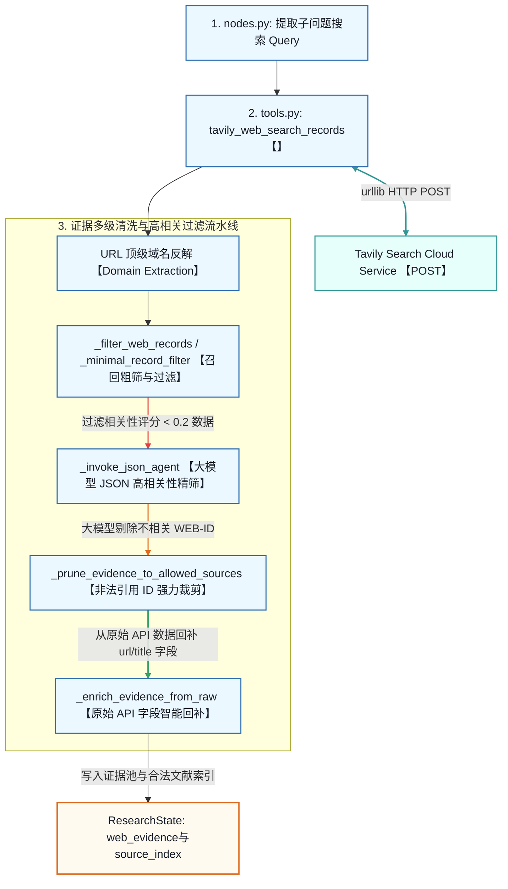

# DeepResearch 企业级多智能体系统：技术 Specification 与源码研读全景指南

本项目是一个基于 **LangGraph**、**FastAPI** 和 **Vue 3** 构建的企业级多智能体深度调研（DeepResearch）系统。系统采用证据驱动（Evidence-Driven）的设计思想，融合了网络实时检索（Tavily API）与本地企业知识库（Milvus RAG），并在底座中构建了精细的双层记忆系统（短期会话 Checkpoint + 长期语义/情景记忆）。

本篇技术规范文档旨在为系统架构师与高级开发人员提供一份**生产级技术规范（Specification）与源码研读手册**，全景解构其拓扑状态机、信源裁判算法、数据流并发模型及多维度存储逻辑隔离机制。

---

## 一、 多智能体协同与工具流全景架构 (Multi-Agent Collaboration & Tool Flow Spec)

本系统的核心是以 **LangGraph** 为底座构建的**有状态多智能体协同 network**。各智能体角色（Persona）通过读写共享状态机沙盒 `ResearchState` 传递上下文，并在执行节点中调用高度安全的物理工具链。

以下为以**多智能体系统为主、工具流调用为骨架**的全景协作与工具流拓扑图：

```mermaid
graph TD
    %% 样式与类定义 (显式指定高对比度暗色文字，防止在深色/暗黑模式下因文字变白导致对比度极低而看不清)
    classDef state fill:#f7fafc,stroke:#4a5568,stroke-width:1.5px,color:#1a202c;
    classDef agent fill:#ebf8ff,stroke:#3182ce,stroke-width:2px,color:#1a202c;
    classDef tool fill:#fffaf0,stroke:#dd6b20,stroke-width:1.5px,color:#1a202c;
    classDef ext fill:#e6fffa,stroke:#319795,stroke-width:1.5px,color:#1a202c;

    %% 共享状态沙盒
    State["ResearchState 共享状态机沙盒<br>存储: query, plan, evidence, findings, gaps, checkpoints"]:::state

    %% 智能体节点 (专家角色)
    Agent_Intent["【意图分流专家】<br>Intent Router 【intent_node】"]:::agent
    Agent_Direct["【极速直答专家】<br>Direct Responder 【direct_answer_node】"]:::agent
    Agent_Architect["【总规划师】<br>Chief Architect 【plan_node】"]:::agent
    Agent_WebScout["【网页侦查兵】<br>Web Scout 【web_search_node】"]:::agent
    Agent_RAGScout["【局内侦查兵】<br>Local RAG Scout 【local_rag_node】"]:::agent
    Agent_Judge["【信源裁判官】<br>Evidence Judge 【deep_dive_node】"]:::agent
    Agent_Analyst["【分析师】<br>Analyst 【analyze_node】"]:::agent
    Agent_Planner["【补搜规划专家】<br>Research Planner 【reflect_node】"]:::agent
    Agent_Writer["【终审写作者】<br>Senior Writer 【write_node】"]:::agent

    %% 物理工具库 (具体函数)
    Tool_Detect["detect_intent【】 规则意图识别"]:::tool
    Tool_Derive["_derive_search_plan【】 计划派生"]:::tool
    Tool_Tavily["tavily_web_search_records【】 实时网搜"]:::tool
    Tool_WebScrape["extract_url_content_stub【】 网页深度解析"]:::tool
    Tool_Milvus["search_knowledge_base_records【】 局内检索"]:::tool
    Tool_Score["_score_evidence【】 信用评级与冲突审计"]:::tool
    Tool_Optimize["optimize_query【】 检索词启发式改写"]:::tool
    Tool_Clean["_validate_and_fix_citations【】 防幻觉引用清洗"]:::tool
    Tool_Render["_render_reference_list【】 学术级去重文献生成"]:::tool

    %% 外部物理基础设施
    Ext_Tavily["Tavily Search API Cloud"]:::ext
    Ext_Milvus["Milvus RAG Vector DB"]:::ext
    Ext_Postgres["PostgreSQL DB 【长期情景记忆】"]:::ext

    %% --------------------------------------------------
    %% 协作与工具流连线
    %% --------------------------------------------------
    
    %% 1. 启动与分流
    State -->|1. 读写共享状态| Agent_Intent
    Agent_Intent -.->|调用工具| Tool_Detect
    Agent_Intent -->|意图=direct 【闲聊/直答】| Agent_Direct
    Agent_Intent -->|意图=multiagent 【深度调研】| Agent_Architect

    %% 2. 任务规划
    Agent_Architect -.->|调用工具| Tool_Derive
    Tool_Derive -->|自动拆解并派生 search_plan| State

    %% 3. 并发双源取证 (控制流实线, 工具调用虚线)
    State -->|2. 并行多路调度| Agent_WebScout
    State -->|2. 并行多路调度| Agent_RAGScout

    %% 网页探路者工具流
    Agent_WebScout -.->|调用工具| Tool_Tavily
    Tool_Tavily <-->|urllib HTTP POST| Ext_Tavily
    Agent_WebScout -.->|抓取特定URL原文| Tool_WebScrape
    
    %% 本地向量探路者工具流
    Agent_RAGScout -.->|调用工具| Tool_Milvus
    Tool_Milvus <-->|向量内积检索| Ext_Milvus

    %% 取证数据写入状态
    Tool_Tavily -->|累加网页证据 web_evidence| State
    Tool_Milvus -->|累加本地证据 local_evidence| State

    %% 4. 证据链裁判与事实收拢
    State -->|3. 汇聚双源成果| Agent_Judge
    Agent_Judge -.->|调用工具| Tool_Score
    Tool_Score -->|生成裁判证据池 evidence_pool & 索引 source_index| State

    %% 5. 结论归纳与缺口评估
    State -->|4. 读取裁判事实| Agent_Analyst
    Agent_Analyst -->|needs_more_research == True 【存在缺口】| Agent_Planner
    Agent_Analyst -->|needs_more_research == False 【完备收敛】| Agent_Writer

    %% 6. 缺口反思补搜环路
    Agent_Planner -.->|调用工具| Tool_Optimize
    Tool_Optimize -->|生成补搜计划 supplementary_queries| State
    Agent_Planner -->|迭代次数增加1, 重新并行取证| Agent_WebScout
    Agent_Planner -->|迭代次数增加1, 重新并行取证| Agent_RAGScout

    %% 7. 研报大作合成与净化
    Agent_Writer -.->|调用工具| Tool_Clean
    Agent_Writer -.->|调用工具| Tool_Render
    Tool_Render <-->|物理去重/映射合并| Ext_Postgres
    Tool_Clean -->|物理抹除胡编死链| Agent_Writer
    Agent_Writer -->|拼接正文、文献附录与检索轨迹| State

    %% 连接线美化
    linkStyle 0 stroke:#3182ce,stroke-width:2px;
    linkStyle 2 stroke:#e53e3e,stroke-width:2px;
    linkStyle 3 stroke:#2b6cb0,stroke-width:2px;
    linkStyle 6 stroke:#319795,stroke-width:2px;
    linkStyle 7 stroke:#319795,stroke-width:2px;
    linkStyle 10 stroke:#38a169,stroke-width:2px;
    linkStyle 11 stroke:#38a169,stroke-width:2px;
    linkStyle 15 stroke:#dd6b20,stroke-width:2px;
    linkStyle 16 stroke:#dd6b20,stroke-width:2px;
    linkStyle 19 stroke:#e53e3e,stroke-width:2px,stroke-dasharray: 5 5;
    linkStyle 20 stroke:#2b6cb0,stroke-width:2px;
```




### 多智能体协同矩阵 (Multi-Agent Cooperation Matrix)

| 智能体角色 (Persona) | 对应图节点 | 协同位置与职责 (Cooperation Purpose) | 绑定的物理工具与流程 (Tool & Process) |
| :--- | :--- | :--- | :--- |
| **【意图分流专家】**<br>Intent Router | `intent_node` | **流水线防卫门卫**。极速判别用户意图是日常闲聊、常识提问，还是严肃技术调研。过滤低价值计算，防止多智能体图网络爆 Token。 | 调用 `detect_intent()` 规则匹配与正则雷达扫描。未命中的复杂问题调用大底座生成 JSON 路由。 |
| **【极速直答专家】**<br>Direct Responder | `direct_answer_node` | **对话闪电侠**。对于日常打招呼、打趣或极简常识，直接生成回复并流转至 `[END]`，绕过繁复的检索，保障毫秒级体验。 | 直接调用大语言模型（LLM）生成拟人化对话，不执行任何外部检索。 |
| **【总规划师】**<br>Chief Architect | `plan_node` | **调研航线指挥官**。将复杂查询深度拆解为多章节研究大纲、多条衍生子问题与检索预算，在后台生成初始全景图检索大图景。 | 调用 `_derive_search_plan()`，将模型产出的大纲自动派生成结构化的 `search_plan` 计划表写入状态机。 |
| **【网页侦查兵】**<br>Web Scout | `web_search_node` | **网络侧取证先锋**。负责拿着被分发好的子检索词，在浩瀚的互联网上高速拉取事实证据，并过滤广告和低信誉站点。 | 调用 `tavily_web_search_records()` 进行 REST 检索；高频调用 `extract_url_content_stub()` 网页正文提取器做内容深度爬取。 |
| **【局内侦查兵】**<br>Local RAG Scout | `local_rag_node` | **私有库取证先锋**。与网页侦查兵并行工作，负责在企业内部向量数据库（Milvus）中进行语义相似性检索，挖出机密数据。 | 调用 `search_knowledge_base_records()` 建立 Milvus 向量连接，通过内积计算召回高可信内部文档切片。 |
| **【信源裁判官】**<br>Evidence Judge | `deep_dive_node` | **事实核验大法官**。将双路并发搜集回来的证据聚拢，剔除重复项，并根据官方/学术/自媒体等信源背书计算信用分，审计冲突点。 | 调用 `_score_evidence()` 执行信源分级打分评级算法；调用 `_fallback_audit()` 建立静默规则审计，生成风险红牌 `audit_flags`。 |
| **【分析师】**<br>Analyst | `analyze_node` | **逻辑整合决策大脑**。阅读裁判后的干净证据，归纳出 Findings 核心论断列表。深度审计当前信息是否完备，控制循环开关。 | 将断言与其对应的文献 `source_id` 实施强绑定。判断并决定全局布尔门阈 `needs_more_research` 的状态。 |
| **【补搜规划专家】**<br>Research Planner | `reflect_node` | **纠偏与战术补给员**。当分析师抛出信息缺口后被激活。反思已检索历史和缺口内容，重新改写更靶向的检索词推进下轮迭代。 | 调用 `optimize_query()` 检索词改写引擎。生成 `supplementary_queries` 并自增 `iteration` 轮次计数器。 |
| **【终审写作者】**<br>Senior Writer | `write_node` | **总撰稿人与安全终审官**。将所有裁判事实 findings 扩写为两三千字的严谨 Markdown 研报，执行文献引用的终极净化。 | 调用 `_validate_and_fix_citations()` 正则物理抹除幻觉引用死链；调用 `_ensure_reference_section()` 自动渲染文末去重文献清单。 |

---

## 二、 Tavily 网页取证与证据清洗过滤流水线 (Tavily Search & Evidence Pipeline)

展示了 `WebScout` 智能体如何调用 Tavily 接口，并对其进行实体高相关粗筛、JSON 精筛、双重去重回补以及合法引用索引沉淀的完整数据处理流水线：

> [!NOTE]
> **设计与工程实现集成说明**：
> 在系统架构设计上，网页取证提供了严格且完备的语义与实体相关性碰撞评估机制（`_filter_web_records` 和 `_filter_local_records`）。在实际生产环境部署中，系统提供并默认启用了更轻量级、响应极致高速的非空过滤层 `_minimal_record_filter`。这既能在大样本场景下物理阻断空字段，又能实现超低时延与零计算消耗，与大模型精筛（`_invoke_json_agent`）完美互补。



---

## 三、 存储底座多维度逻辑隔离规范 (Data Storage Isolation Spec)

当多个 Agent 系统（例如外部 `cloud_agent` 客服系统）共享相同的物理数据库/缓存实例时，本系统在环境配置层面实现了**全维度的逻辑隔离**，保障生产环境下数据的一致性与高并发下的 Key 隔离。

| 存储中间件 | 作用层级 | 源项目配置 (cloud_agent) | 当前项目隔离配置 (deep_research) | 逻辑隔离技术实现原理 |
| :--- | :--- | :--- | :--- | :--- |
| **Redis** | 短期会话级 Checkpoint 状态缓存 | `redis://...:6379` (默认 DB 0) | **`redis://...:6380` (端口 6380 独立实例)** | **物理端口/实例隔离**：放弃修改逻辑 DB 索引为 `/1`，直接将 Redis 连接端口更改为物理隔离的 `6380` 实例，实现完全独立的物理缓存区。 |
| **PostgreSQL** | 长期会话 Checkpointer 与语义实体 | MySQL 物理库 `mydb` | **`postgresql://...:5432/deep_research_db`** | **Schema / 库级物理隔离**：在 PostgreSQL 实例中建立专用的 `deep_research_db`，使长周期记忆及轨迹表彻底与源项目的业务库解耦。 |
| **Milvus** | 企业内部语义切片向量知识库 | `MILVUS_COLLECTION=mult_agent_memory2` | **`MILVUS_COLLECTION=deep_research_memory`** | **集合 (Collection) 级隔离**：在 Milvus 向量引擎中创建专属的 `deep_research_memory` 向量集合，彻底物理隔离 RAG 数据集，保证检索高精确。 |

---

## 四、 多智能体架构跨文件全景执行流程 (Cross-File Execution Flow Walkthrough)

整个 DeepResearch 调研任务的执行流在系统各层代码文件之间呈严密的**时间线流转（Chronological Flow）**。以下是全景跨文件执行轨迹的深度解析：

### 1. 系统引导与网关唤醒阶段 (Bootloader & HTTP Phase)
1.  **引导入口**：用户在 Shell 运行 `main.py` 或启动 FastAPI 服务 [app_main.py](file:///d:/AI/deep_research/deep_research/app/app_main.py)。
2.  **环境装载**：`_bootstrap()` 函数被激活，解析 [.env](file:///d:/AI/deep_research/deep_research/.env)（获取获取去除了引号污染的 DashScope Key、Tavily Key 及物理端口隔离的 Redis/Postgres 配置），并使用 `sys.path.insert(0, str(src))` 将 `app/` 注册到 Python 系统路径。
3.  **网关开启**：[app_main.py](file:///d:/AI/deep_research/deep_research/app/app_main.py) 装载 [research_router.py](file:///d:/AI/deep_research/deep_research/app/backend/router/research_router.py)，启动 FastAPI 服务。
4.  **前端请求**：用户通过 Vue 界面 [App.vue](file:///d:/front/agent_front/src/App.vue) 提问，发送 HTTP POST 至 `/api/v1/research/stream`，网关路由拦截请求并开始执行桥接。

### 2. 多路复用桥接与记忆注入阶段 (Bridge & Memory Phase)
1.  **唤醒服务**：`research_router.py` 将负载直接传递给 [workflow_service.py](file:///d:/AI/deep_research/deep_research/app/backend/service/workflow_service.py) 的 `WorkflowService.stream_events` 异步生成器。
2.  **构建环境**：服务执行 `_ensure_initialized()`：
    *   读取静态配置 [config.json](file:///d:/AI/deep_research/deep_research/config.json) 获取硬隔离的 Milvus 集合名称和 6380 端口物理隔离 Redis 实例；
    *   装载并实例化 `MemoryManager`；
    *   调用 `build_agents()` 初始化 Qwen 模型大底座，绑定专有系统人设（[prompts.py](file:///d:/AI/deep_research/deep_research/app/mult_agents/prompts.py)）；
    *   构建 PostgreSQL 连接上下文，作为会话的 `Checkpointer`。
3.  **记忆注入**：`WorkflowService` 调度 `MemoryManager` 触发跨会话记忆检索，在关系库中查出先前的用户偏好并格式化为 `memory_context`。
4.  **状态沙盒初置**：调用 [state.py](file:///d:/AI/deep_research/deep_research/app/mult_agents/state.py) 的 `create_initial_state` 工厂函数，将 `query`、`user_id`、`tenant_id` 及 `memory_context` 封装成标准字典，装载入 LangGraph 状态机沙盒。
5.  **拉起 Worker 线程**：创建同步工作流执行线程，在后台启动 `workflow.stream()`，同时主事件循环异步监听 `asyncio.Queue`。

### 3. 多智能体拓扑执行阶段 (State Machine Execution Phase)
LangGraph 驱动以下节点在 [nodes.py](file:///d:/AI/deep_research/deep_research/app/mult_agents/nodes.py) 和 [tools.py](file:///d:/AI/deep_research/deep_research/app/mult_agents/tools.py) 之间高速流转：

#### Ⅰ. 意图分流与大纲规划 (`intent_node` & `plan_node`)
*   `intent_node` 结合规则正则与大模型推理，决定将任务直接派发给 `direct_answer_node`（返回直答并 `END`）还是流转至 `plan_node`。
*   `plan_node` 扮演总架构师，调用 [prompts.py](file:///d:/AI/deep_research/deep_research/app/mult_agents/prompts.py) 的 `"plan"` 系统提示词产生任务规划。随后调用 `_derive_search_plan` 生成多章节的**结构化搜索计划**并写入状态中的 `search_plan`。

#### Ⅱ. 双源并发网页与知识库取证 (`web_search_node` & `local_rag_node`)
*   `web_search_node` 读取 `search_plan`：
    *   提取搜索词，循环调用 [tools.py](file:///d:/AI/deep_research/deep_research/app/mult_agents/tools.py) 的 **`tavily_web_search_records`**。
    *   Tavily 搜索引擎通过 `urllib` 标准库的 HTTP POST 抓取最新的互联网资讯返回；
    *   代码在 `tools.py` 内部计算 `domain`，返回到节点后由大模型进行 JSON 精筛（`_invoke_json_agent`）。
    *   执行 `_enrich_evidence_from_raw` 字段回补，并将清洗去重后的成果累加进状态中的 `web_evidence`。
*   同时，`local_rag_node` 在另一个并发管道中并发调用 [tools.py](file:///d:/AI/deep_research/deep_research/app/mult_agents/tools.py) 的 `search_knowledge_base` 检索私有向量库（[rag/core.py](file:///d:/AI/deep_research/deep_research/app/mult_agents/rag/core.py)），召回企业内部机密文档作为补充证据，累加至 `local_evidence`。
*   网关在每完成一个节点计算时，向 `asyncio.Queue` 发生包含当前执行说明（如 `[web_search] Web Scout 正在检索网络证据`）的更新字典。

#### Ⅲ. 证据链评分裁判与事实提炼 (`deep_dive_node` & `analyze_node`)
*   `deep_dive_node` 汇集双源证据，扮演 EvidenceJudge 审查员角色，根据域名解析特征执行**证据基准可信度打分算法**（本地 RAG 享 0.92 分，权威 gov/edu 享 0.88 分，自媒体享极低分），并对冲突与低置信度数据打上 `audit_flags` 风险标记，最终凝聚成 `evidence_pool` 和合法文献索引 `source_index`。
*   `analyze_node` 读取证据事实数据库，提炼生成 findings 核心论断列表，并评估信息完备性。

#### Ⅳ. 缺口反思环路 (`reflect_node`)
*   如果 `Analyst` 发现核心问题依然存在信息缺口，会将 `needs_more_research` 设为 `True`，并向状态写入 `missing_gaps`。
*   在条件路由的判定下，工作流重定向至 `reflect_node`：
    *   智能体基于已执行过的搜索历史和缺口内容，重新改写生成新的更靶向的检索 Query，写入 `supplementary_queries`。
    *   工作流 `iteration` 次数递增，重新流转回网络取证与本地 RAG 节点，开启新一轮的取证。

#### Ⅴ. 研报长文撰写与引用自动清洗校验 (`write_node`)
*   当状态判定满足收敛条件（无缺口或迭代超限）后，流转至 `write_node`。
*   **上下文清空连接**：为了防止累积的大量 JSON 带偏模型，节点只喂给模型当前子问题的 findings、可引用的 source_index 列表及纯文本指令。
*   **正文草稿生成**：SeniorWriter 智能体调用大语言模型进行长文扩写。
*   **合法性引用检验**：调用 `_validate_and_fix_citations`，利用正则反向提取正文中的所有引用 ID，删除模型虚构的死链，回补并渲染文末 `## 参考资料`。
*   **合并最终研报**：合并正文与文献列表，写入状态中的 `final`。

### 4. 拆线落库与客户端响应阶段 (Teardown & Rendering Phase)
1.  **会话后持久化**：LangGraph 执行完毕，`WorkflowService` 捕获终稿。
    *   调用短期 `Checkpointer`，将物理会话 Checkpoint 异步写入物理隔离的 `Redis Port 6380` 独立实例空间；
    *   调用 `MemoryManager.persist_turn()`，将本次用户交互及产出的高品质研报在后台多线程异步落库至 PostgreSQL 长期情景表中，丰富情景记忆。
2.  **最终事件回传**：服务向 `asyncio.Queue` 注入 `type: 'final'` 标记包，关闭异步生成器，FastAPI 将最后的事件流推送至前端。
3.  **前端交互渲染**：Vue 前台 [App.vue](file:///d:/front/agent_front/src/App.vue) 结束骨架屏进度日志展示，将 `final` 研报字段通过自定义 Markdown 引擎动态高亮高品质展示，整个深度调研任务闭环结束。

---

## 五、 Tavily 智能网搜集成规范 (Tavily Search Spec)

本系统使用全球领先的学术及开发者智能搜索引擎 **Tavily Search API** 作为默认网页取证内核。

### 1. Tavily 零外部包依赖设计 (Zero-Dependency API Wrapper)
为了确保核心代码的轻量化与极致可移植性，系统摒弃了 `tavily-python` SDK 包装，转而使用 Python 内建标准库 `urllib` 实现高并发网络适配器。

#### 请求-响应 Schema 映射规格
*   **API 终结点 (Endpoint)**: `https://api.tavily.com/search`
*   **请求方法 (Method)**: `POST`
*   **请求负载 (Request Body JSON)**:
    ```json
    {
      "api_key": "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",
      "query": "search query",
      "max_results": 4
    }
    ```
*   **响应负载 (Response JSON)**:
    ```json
    {
      "results": [
        {
          "title": "Title of Web Page",
          "url": "https://example.com/subpath",
          "content": "Core snippet of context parsed by Tavily search engine...",
          "score": 0.9821
        }
      ]
    }
    ```
*   **域名解析过滤**:
    代码使用内建的字符串切片与正则对 `url` 进行反解，动态抽取出二级或顶级域名 `domain`，提供给信源打分模型：
    ```python
    # 域名反解逻辑示例
    url = "https://www.official-report.gov.cn/ai-agent-2026"
    domain = url.split("://", 1)[1].split("/", 1)[0]
    # 解析结果：domain = "www.official-report.gov.cn"
    ```
